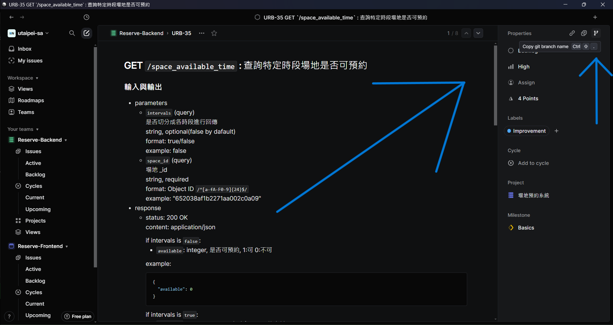

# 4.2 分支命名規範 Branch Naming Rules

Use Linear's "Copy git branch name" feature to name the branches.

1. Click the "Copy git branch name" button


2. Use the string copied to name your branch.

Or, if you don't like Linear's "Copy git branch name" feature, you can follow the traditional naming conventions: 

```
{type}-{summary}
```

All alphabets should be **lowercase**.

Only alphabets and `-` are accepted. Other characters should all be replaced by `-`.
